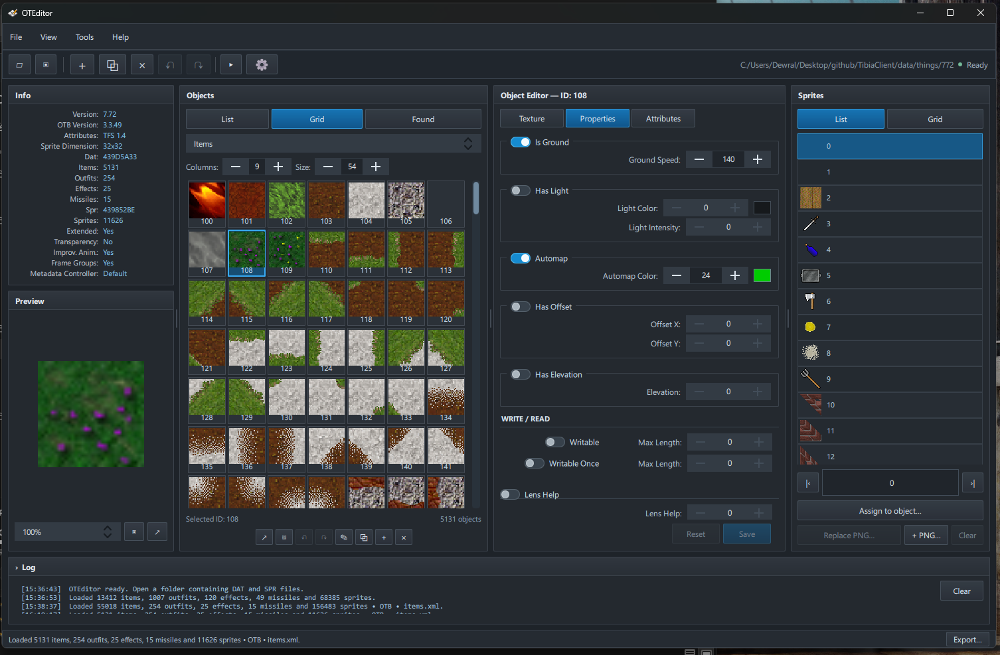

# OTEditor

A Tibia object editor for Windows built with Qt 6, QML, and C++20. The dark workspace uses the Fluent Dark palette from DewralMapEditor.



## Getting started

Download the latest [Windows release](https://github.com/dewral/OTEditor/releases/latest), extract the ZIP, and run `OTEditor.exe`. Keep the included runtime files together.

1. Select **File → Open** and choose a folder containing DAT and SPR files.
2. Optionally select a server folder containing `items.otb` and `items.xml`. Without server files, client editing remains available and server attributes are hidden.
3. Choose the DAT format version. OTFI settings take precedence for extended sprites, transparency, frame durations, and frame groups.
4. Select an object to edit its texture, properties, or server attributes.
5. Use **Compile** (`Ctrl+S`) to save, or **Compile As** (`Ctrl+Shift+S`) to write a separate project.

## Features

- Items, outfits, effects, and missiles with list/grid browsing and multi-selection.
- DAT properties and editable SPR textures, animation durations, frame groups, layers, and patterns.
- Sprite drag and drop, PNG import, pixel editing, and undo/redo.
- Sprite-sheet slicer with grid selection, rotation, mirroring, zoom, and transparency handling.
- Batch export to PNG, BMP, JPG, and ObjectBuilder OBD. Outfit directions occupy columns and animation frames occupy rows.
- OBD v1–v3 import and v3 export for 32×32 sprites.
- OTB attributes and server/client ID mapping; names synchronized with `items.xml`.
- XML attribute editing, missing OTB item creation, project conversion, and optimization tools.
- Atomic project writes and preservation of unchanged sprite data.
- Built-in update checking and installation from GitHub releases.

## AI Sprite Generator

**Tools → AI Sprite Generator** connects to [AI Sprite Studio](https://aispritestudio.com/). Enter an API key, choose a model, and describe a creature or item. Results can be saved as PNG or opened in the slicer. Generation does not automatically create an object or assign frames and directions.

The API key stays in memory. Generation uses provider credits. Retry Submission reuses the original request key after an uncertain submission; Cancel stops local waiting and does not cancel the provider's job. Adding sprites to SPR requires an open client.

## Building

Requirements: Qt 6.5+ (Core, Gui, Qml, Quick, QuickControls2, Network, Widgets, Test), liblzma, CMake 3.24+, Ninja, and a compatible C++20 compiler.

```powershell
./scripts/build.ps1 -Deploy
```

The script defaults to Qt 6.10.2 and MinGW 13.1. Set `QT_ROOT` or adjust the toolchain paths for your installation. A running local EXE is replaced after it closes, allowing current work to be saved.

For another toolchain:

```powershell
cmake -S . -B build -G Ninja -DCMAKE_PREFIX_PATH=C:/Qt/6.10.2/mingw_64 -DCMAKE_BUILD_TYPE=Release
cmake --build build
ctest --test-dir build --output-on-failure
```

## Compatibility

OTEditor is not a complete replacement for ObjectBuilder. Complex nested XML is preserved but cannot be edited through the attribute controls. Conversion does not recreate unsupported client features or rewrite arbitrary server XML semantics.

OTB round-trip tests covered 37 files and 765,403 records across major versions 1, 2, and 3. Direct loading of the output in TFS, RME, and ObjectBuilder was not tested. See the [compatibility report](docs/testing/otb-compatibility.md).

## Credits

ObjectBuilder version metadata is covered by [its MIT license](assets/ObjectBuilder-LICENSE.txt). Client graphics are not included in the release package.
